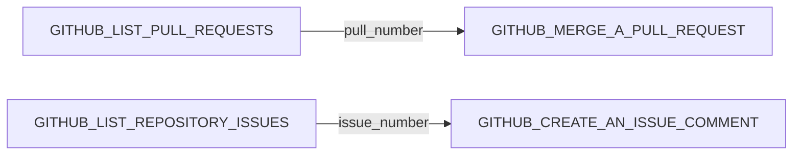
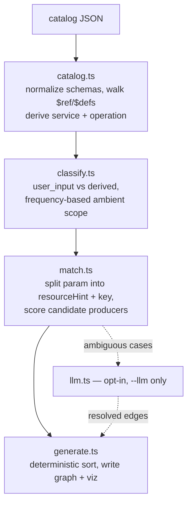

# Dep Graph

**A generator that reads *any* Composio toolkit catalog and figures out, for every tool's
required parameters, whether an agent should ask the user for it — or call another tool first.**

Point it at a JSON catalog. It reads the schemas, infers which tools produce the values other
tools need, and writes a scored, evidence-backed dependency graph. No hand-written rules about
GitHub, no fixed graph — the same code runs on a catalog it's never seen, argued below.

```bash
npm install
npx tsx src/generate.ts github_catalog.json   # -> dependency_graph.json + viz/graph.html
npm run selfcheck                             # golden chains, invariants, generalization proof
```

## The problem in one example

`GITHUB_MERGE_A_PULL_REQUEST` needs a `pull_number`. If all you have is a branch name, you
first need to call `GITHUB_LIST_PULL_REQUESTS` to find it. Multiply that by ~900 tools and
dozens of similar dependencies, and hand-writing the graph doesn't scale — so this generates it
from the catalog's own schemas instead.



The naive fix — match parameter names against output field names — fails immediately: producers
expose generic keys like `number` or `id` nested in arrays, while consumers ask for qualified
ones like `pull_number`. Matching on the bare key alone wires *every* list tool to *every*
consumer that needs any id at all.

## How it actually works



1. **Normalize** (`src/catalog.ts`) — accepts array or `{items}` catalogs, flat or JSON-Schema
   params, and recursively walks output schemas (`properties` → `items` → `anyOf` → `$ref`/`$defs`)
   down to flat leaf fields with a full path, e.g. `data.issues[].number`.
2. **Classify** (`src/classify.ts`) — every *required* input param is labeled `user_input` or
   `derived`, using id/number/sha-style name patterns, description phrases, and a
   frequency-detected "ambient scope" bucket for params like `owner`/`repo`/`org` that show up
   on a large fraction of the whole catalog — never a hardcoded name list.
3. **Match** (`src/match.ts`) — the core. Splits a derived param into a *resource hint* and a
   *key* (`pull_number` → `pull` + `number`), and requires the producer's **array element
   type** — the path segment right before `[]` — to agree with the hint. That's what tells
   `GITHUB_LIST_PULL_REQUESTS` apart from the dozens of other tools that also happen to expose a
   bare `number`.
4. **Score, don't just match** — candidates get `+0.4` for genuinely enumerating entities
   (array), `+0.3`/`+0.2` for read/create operations, `+0.1` when the producer's whole-tool
   purpose corroborates, `-0.5` if the producer itself requires that same param (circular). Top
   2 survive, precision over recall throughout.
5. **Emit deterministically** — nodes and edges are explicitly sorted before writing, so two
   runs on the same catalog produce a byte-identical file.
6. **Disambiguate — optionally** (`src/llm.ts`, behind `--llm`) — for the residue where
   schema-matching found zero candidates, a close score gap, or a 3-way tie at the top score. It
   never touches the rest of the graph, never runs by default, caches responses so reruns cost
   zero tokens, and degrades to the deterministic result on any failure.

## Proving it generalizes

`npm run selfcheck` runs the exact same code, unmodified, against
[`fixtures/mini_toolkit.json`](fixtures/mini_toolkit.json) — a hand-invented 6-tool task-tracker
toolkit (`TASKR_*`) — and asserts the expected edges appear. There's also a build-time grep
test that fails if the literal string `GITHUB` ever shows up in the matching logic. This isn't
a GitHub-shaped generator that happens to also run elsewhere; the toolkit's vocabulary is
inferred from whatever catalog it's handed, every time.

## Try it

```
current run on github_catalog.json:
  893 nodes · 714 edges · 122 distinct services · 72 distinct labels
```

Open [`viz/graph.html`](viz/graph.html) directly in a browser — no server needed, the graph
data is inlined. Color-coded by service, directed arrows, hover for the edge's label, filter by
service, search by slug, isolated nodes hidden by default.

## Project layout

```
src/
  catalog.ts    normalize the catalog + derive service/operation
  classify.ts   user_input vs derived required-param classification
  match.ts      the scoring engine — the core of the project
  llm.ts        optional, opt-in disambiguation pass
  viz.ts        writes the self-contained HTML visualization
  generate.ts   entrypoint, wires everything together
  validate.ts   golden chains, shape invariants, generalization proof
fixtures/
  mini_toolkit.json   invented toolkit, proves generalization
viz/
  graph.html          generated visualization
APPROACH.md    the scoring model, in ~35 lines
WALKTHROUGH.md pipeline tour + Q&A
```

## Design principles

- **Precision over recall.** A confidently-correct 700-edge graph beats a 5,000-edge graph full
  of plausible-looking noise. Zero-producer derived params are printed as a finding — genuine
  "must ask the user" cases — not treated as a failure.
- **Offline by default.** No network call, no API key, on the default path. The LLM pass is
  strictly additive and scoped to the ambiguous tail.
- **Evidence, not a black box.** Every edge carries `confidence`, `evidence` (the exact producer
  field path and which scoring rules fired), and `source` (`schema` or `llm`).

## Known limitations

Homonym collisions between genuinely different resources that share an English word — a *check
run* vs. a *workflow run*, a *PR review* vs. a *deployment review* — aren't resolved by schema
alone; the `--llm` pass targets exactly this when it triggers, but not every instance produces a
tie. No multi-hop resolution (A needs B needs C isn't chased transitively) and no cross-toolkit
dependencies. Full writeup in [`APPROACH.md`](APPROACH.md).

---

Built for a Composio take-home assessment. Original brief preserved at
[`consigne.md`](consigne.md).
